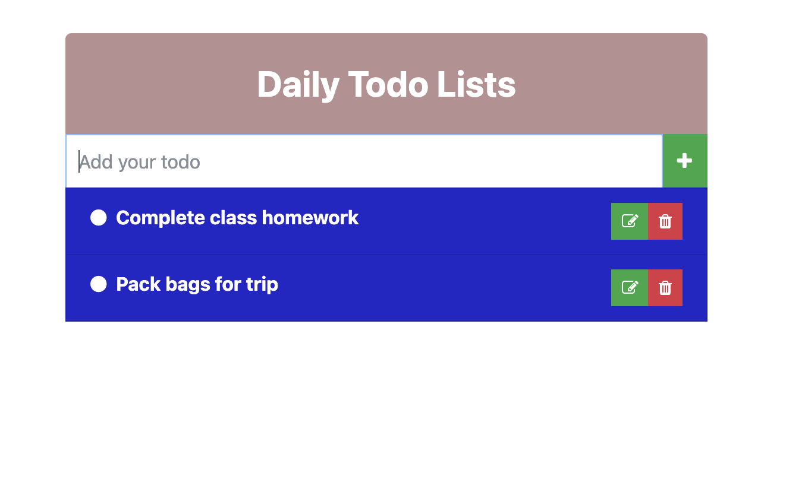

# Golang Todo List 

## API Details 
### GET TODO 
    - Route : "/todo/"  
    - Description: To get all the todo stored in the postgres 
    - Successfull Response: An array of todos 
    - Unsuccessful Response: - HTTP Status Processing code and error message

### POST TODO
     - Route : "/todo/"  
    - Description: To create  todo and store in the postgres 
    - Successfull Response: Success message and todo id 
    - Unsuccessful Response: - HTTP Status Processing code (unable to store in database ) OR Valdiation Error message (if title is empty )

### PUT TODO 
     - Route : "/todo/{id}"  
    - Description: To update or make todo as completed and store in the postgres 
    - Successfull Response: Success message 
    - Unsuccessful Response: - HTTP Status Processing code (unable to store in database ) OR Valdiation Error message (if id or title is empty )

### DELETE TODO 
    - Route : "/todo/{id}"  
    - Description: To delete a todo and delete from postgres 
    - Successfull Response: Success message 
    - Unsuccessful Response: - HTTP Status Processing code (unable to delete from database ) OR Valdiation Error message (if id or title is empty )

## Steps to execute the code 
- Install all the dependencies: go, postgres 
- Install all the go modules:  `go mod tidy`
- Create an .env file: use .env-example for reference and add all postgres config details 
- Build the code and run the program:  `go build`  `./todo`
- Start using the todo app at `localhost:9010`

